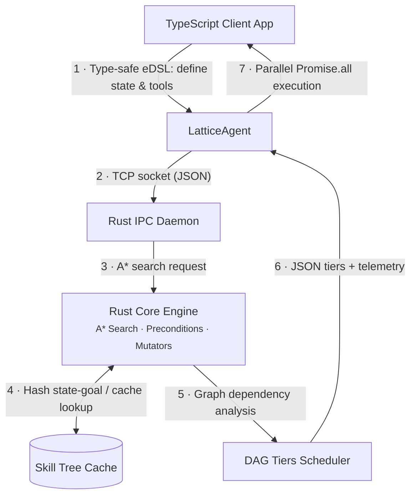

# 🌀 Lattice

> **Deterministic Agent-Oriented Programming (DAOP) Framework**
> Build mathematically safe, parallelized, and microsecond-fast agentic workflows in TypeScript powered by a high-performance Rust planning core.

[](https://github.com/Abick91/lattice)
[](https://opensource.org/licenses/MIT)
[](https://www.rust-lang.org/)
[](https://www.typescriptlang.org/)

---

## 💡 What is Lattice?

Unlike stochastic AI frameworks that rely on large language models (LLMs) which suffer from hallucinations, high latency, and unpredictable costs, **Lattice** takes a 100% mathematical and deterministic approach to agent orchestration.

Lattice uses **State-Space Search (A*)**, **Canonical Caching (Skill Tree)**, and **Out-of-Order Execution Scheduling (DAG)** to compose plans of action. Developers declare agent states and tools in TypeScript, and Lattice computes the optimal execution path in microseconds.

### 🌟 Key Features

*   🚀 **High-Performance Rust Core**: Optimal $A^*$ graph search planner written in Rust.
*   ⚡ **Persistent TCP IPC Daemon**: Background daemon (similar to `esbuild`) that drops process spawning latency to **< 10ms** for IPC transactions.
*   🔀 **Parallel DAG Scheduler**: Automatically detects Read-After-Write (RAW), Write-After-Write (WAW), and Write-After-Read (WAR) hazards to group independent actions into parallel tiers executed via `Promise.all`.
*   🧠 **Skill Tree Caching**: Canonical state-goal hashing caches calculated plans to disk (`.lattice_cache.json`) for instant **$O(1)$** lookup times.
*   🔍 **Rich Predicates & Mutators**: Supports advanced operators (`$gt`, `$lt`, `$gte`, `$lte`, `$eq`, `$ne`) in preconditions and mathematical mutators (`$add`, `$sub`, `$set`) in effects.
*   🎨 **DevTools CLI Visualizer**: Beautiful colored ASCII decision trees printed in the console to debug the agent's state-space exploration.

---

## 🛠️ Architecture



---

## 🧠 Rust Core vs. 📘 TypeScript Client

Lattice is a **two-layer system** where each half needs the other. Think of it
as a **brain and a body**:

| | 🦀 **Rust Core** (the brain) | 📘 **TypeScript Client** (the body + interface) |
| :--- | :--- | :--- |
| **Role** | Computes *what to do* | Defines and *does* it |
| **Responsibility** | A\* planning, precondition/effect evaluation, skill-tree caching, DAG dependency analysis | The developer-facing eDSL, running each action, orchestrating parallel execution |
| **Why this language** | Deterministic and microsecond-fast; no GC pauses | Ergonomic typed API and the native `async` ecosystem where real I/O lives |
| **Where it lives** | `src/*.rs`, `lattice-daemon` binary, WASM build | `lattice_client_server_interface.ts`, `lattice_bridge.ts` |

**How they cooperate:**

1. You declare state, tools, preconditions and goals in **TypeScript** — the
   type-safe eDSL. This is the public API you program against.
2. The client sends that problem to the **Rust** planner (over a persistent TCP
   daemon, or in-process via WASM). Rust searches the state space with A\* and
   returns the *optimal plan*, grouped into parallel DAG tiers plus telemetry.
3. Back in **TypeScript**, the client executes each action — your
   `execute: async (state) => {...}` functions do the real work (API calls, DB
   writes, transfers). Rust decides *what* to do; Node *does* it.

> **Why ship them together?** The Rust core on its own is just a search
> algorithm — it can't touch the real world. The TypeScript client on its own
> has no planning engine. Together they are a single framework: **write your
> agents in TypeScript, plan them in Rust.**

---

## 🚀 Quick Start

### 1. Prerequisites
Ensure you have [Rust (Cargo)](https://rustup.rs/) and [Node.js (npm)](https://nodejs.org/) installed.

### 2. Clone and Install Dependencies
```bash
git clone https://github.com/Abick91/lattice.git
cd Lattice
npm install
```

### 3. Build the Rust Planning Core
```bash
cargo build --release
```

### 4. Run the Ledger Reconciliator Example
```bash
npx tsc
node dist/lattice_workflow_example.js
```

---

## 💻 Code Example

Here is how simple it is to build a type-safe, self-correcting parallel workflow with Lattice:

```typescript
import { LatticeAgent, ToolDefinition } from './lattice_bridge';

// Define the shape of your agent's state
interface LedgerState {
    balance: number;
    invoiceApproved: boolean;
    fundsDisbursed: boolean;
    identityVerified: boolean;
    reconciliationReportSent: boolean;
}

// 1. Define actions with preconditions and effects mutators
const DepositCollateral: ToolDefinition<LedgerState> = {
    id: "DepositCollateral",
    preconditions: { balance: { $lt: 100 } },
    effects: { balance: { $add: 50 } }, // Mathematical mutator
    execute: async (state) => {
        console.log(`[Tool] Depositing collateral...`);
        return { balance: state.balance + 50 };
    }
};

const VerifyIdentity: ToolDefinition<LedgerState> = {
    id: "VerifyIdentity",
    preconditions: { identityVerified: false },
    effects: { identityVerified: true },
    execute: async () => {
        return { identityVerified: true };
    }
};

const ApproveInvoice: ToolDefinition<LedgerState> = {
    id: "ApproveInvoice",
    preconditions: {
        balance: { $gte: 100 }, // Numeric boundary check
        invoiceApproved: false
    },
    effects: { invoiceApproved: true },
    execute: async () => {
        return { invoiceApproved: true };
    }
};

// 2. Initialize the agent and declare the goal state
const agent = new LatticeAgent<LedgerState>({
    initialState: {
        balance: 50,
        invoiceApproved: false,
        fundsDisbursed: false,
        identityVerified: false,
        reconciliationReportSent: false
    },
    tools: [DepositCollateral, VerifyIdentity, ApproveInvoice],
    goal: {
        reconciliationReportSent: true
    },
    enableDevTools: true // Enable DevTools CLI Visualizer
});

// 3. Execute
const finalState = await agent.run();
```

---

## 🔍 DevTools Visualizer Output

When running with `enableDevTools: true`, Lattice prints the entire state-space tree traversed by the $A^*$ search engine:

```text
=== LATTICE DEVTOOLS: STATE-SPACE SEARCH TREE ===
└── [Start] (g=0, h=1, f=1) -> State: {"balance":50,"invoiceApproved":false,...}
    ├── [DepositCollateral] (g=1, h=1, f=2) -> State: {"balance":100,"invoiceApproved":false,...}
    │   ├── [ApproveInvoice] (g=2, h=1, f=3) -> State: {"balance":100,"invoiceApproved":true,...}
    │   │   ├── [VerifyIdentity] (g=3, h=1, f=4) -> State: {"balance":100,"identityVerified":true,...}
    │   │   │   └── [DisburseFunds] (g=4, h=1, f=5) -> State: {"balance":0,"fundsDisbursed":true,...}
    │   │   │       └── [SendReconciliationReport] (g=5, h=0, f=5) -> State: {"reconciliationReportSent":true,...}
```
*   **Green elements** (in terminals supporting ANSI colors) indicate the chosen optimal path.
*   **Yellow/Gray elements** indicate explored alternative branches and dead ends discarded during planning.

---

## 📊 Performance Comparison

| Metric | Stdin/Stdout Process Spawn | Persistent TCP Daemon IPC | Change |
| :--- | :---: | :---: | :---: |
| **Initial Plan Spawn** | ~180 ms | **~29 ms** | **-83.8%** |
| **Cached Plan Lookup** | ~50 ms | **< 9 ms** | **-82.0%** |
| **Subsequent Planning** | ~120 ms | **< 14 ms** | **-88.3%** |

*Measurements taken on Windows 11, Ryzen 7, executing the ledger reconciliator workflow.*

---

## 📄 License

Lattice is open-source software licensed under the **MIT License**.
